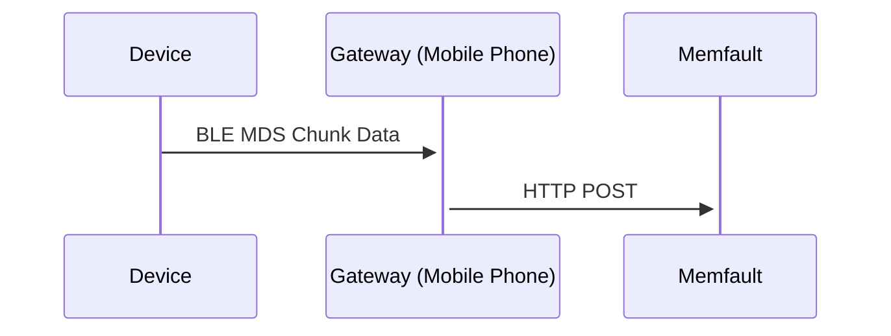

import { TroubleshootingDataTransfer } from "@site/src/components/TroubleshootingDataTransfer";
import NordicMDS from "@site/src/pages/_partials/_nordic-mds.mdx";
import Tabs from "@theme/Tabs";
import TabItem from "@theme/TabItem";

## Introduction {#introduction}

The Memfault Diagnostic Service (MDS) GATT service is a standardized way for BLE
devices to send Chunk payloads to a gateway device (eg mobile phone) which can
then forward the data to the Memfault cloud.

The service is designed such that the gateway can be agnostic to the data being
forwarded.

## Memfault Diagnostic Service (MDS) Description {#memfault-diagnostic-service-mds-description}

### GATT Service {#gatt-service}

| Service                     | UUID                                 |
| --------------------------- | ------------------------------------ |
| Memfault Diagnostic Service | 54220000-f6a5-4007-a371-722f4ebd8436 |

### Characteristics {#characteristics}

| Name                                           | Properties    | UUID                                 | Length   | Description                                                                                                                        |
| ---------------------------------------------- | ------------- | ------------------------------------ | -------- | ---------------------------------------------------------------------------------------------------------------------------------- |
| MDS Supported Features Characteristic          | Read          | 54220001-f6a5-4007-a371-722f4ebd8436 | Variable | Bitmask of features that have been added to MDS Profile. At the moment, returns 0x0 since this is the first version of the profile |
| MDS Device Identifier Characteristic           | Read          | 54220002-f6a5-4007-a371-722f4ebd8436 | Variable | Returns the device identifier populated in the `memfault_platform_get_device_info()` dependency function                           |
| MDS Data URI Characteristic                    | Read          | 54220003-f6a5-4007-a371-722f4ebd8436 | Variable | Returns the URI diagnostic data should be forwarded to                                                                             |
| MDS Authorization Characteristic               | Read          | 54220004-f6a5-4007-a371-722f4ebd8436 | Variable | Returns the configured authorization to use such as `"Memfault-Project-Key:YOUR_PROJECT_KEY"`                                      |
| MDS Data Export Characteristic                 | Notify, Write | 54220005-f6a5-4007-a371-722f4ebd8436 |          | Streams any collected SDK data to listener as opaque packets. See below.                                                           |
| Client Characteristic Configuration Descriptor | Read, Write   | 00002902-0000-1000-8000-00805f9b34fb |          | Associated with MDS Data Export Characteristic above                                                                               |

#### MDS Data Export Characteristic {#mds-data-export-characteristic}

To enabling streaming, the characteristic must be subscribed to and a mode must
be configured via a GATT write to the characteristic.

Valid Modes (1 Octet):

| Mode | Description                      |
| ---- | -------------------------------- |
| 0x00 | Streaming Disabled               |
| 0x01 | Streaming of all data is enabled |

Other modes are reserved for future use.

Packets will be sized to fit within negotiated MTU.

Packet Format:

| Offset | Size | Description                                                                                                                                                                               |
| ------ | ---- | ----------------------------------------------------------------------------------------------------------------------------------------------------------------------------------------- |
| byte 0 | 1    | bits 0-4: A sequentially increasing counter (0-31) that can be used to detect accidental repeat or dropped notifications which wraps around at 31 bits. Bits 5-7: Reserved for future use |
| byte 1 | 1+   | Variable payload bytes (chunk data)                                                                                                                                                       |

Listener is responsible for forwarding chunks to the URI specified in the Data
URI Characteristic using the authorization scheme specified in the Authorization
Characteristic."

## WebBluetooth client {#webbluetooth-client}

We've implemented a reference client in WebBluetooth. Any device which
implements the MDS profile can be connected and the WebBluetooth client will
forward diagnostic data published.

- [Source code can be found here](https://github.com/memfault/web-ble-example/blob/main/mds.js)
- [Client can be launched here](https://mflt.io/mds/)

> Note: currently Web Bluetooth is best supported on Chrome, and depends on the
> device's BLE stack to support the necessary features. It should work on most
> modern Android devices and desktops with BLE support.
>
> It may be necessary to enable these flags:
>
> - [`chrome://flags/#enable-experimental-web-platform-features`](chrome://flags/#enable-experimental-web-platform-features)
> - [`chrome://flags/#enable-web-bluetooth`](chrome://flags/#enable-web-bluetooth)

## Nordic Clients {#nordic-clients}

<NordicMDS />

## Notes {#notes}

### Length requirement {#length-requirement}

If length exceeds negotiated MTU size, it is assumed that client has implemented
support for long attribute reads. (iOS & Android both support this). If long
attribute reads are not supported for some reason, an MTU needs to be negotiated
which exceeds the length of the **Project Key** and **Device Identifier**.

### Future characteristic updates {#future-characteristic-updates}

If additional characteristics are ever added to the service, they will be
appended to the table to minimize impact for clients who have not (correctly)
implemented the "Service Changed" characteristic in the Generic Attribute
Profile Service.

### Restricting access {#restricting-access}

For production applications and enhanced security and privacy, it is recommended
to restrict access so that diagnostic data is only published if the connection
is bonded and the link is encrypted.

<Tabs
  defaultValue="ncs"
  values={[
    {label: 'NCS', value: 'ncs'},
    {label: 'Other', value: 'other'},
  ]}>
  <TabItem value="ncs">

Set `CONFIG_BT_MDS_PERM_RW_ENCRYPT=y` in your `prj.conf`. See the
[Nordic documentation](https://docs.nordicsemi.com/bundle/ncs-3.1.0/page/nrf/libraries/bluetooth/services/mds.html#configuration)
for more detail about the MDS configuration options in NCS.

</TabItem>

<TabItem value="other">

Implement `memfault_mds_access_enabled()`. See the
[function comments in the Memfault Firmware SDK](https://github.com/memfault/memfault-firmware-sdk/blob/2d0fd16645e7c7b1aac78b4756045f222e470627/ports/include/memfault/ports/ble/mds.h#L90-L103)
for more details.

</TabItem>

</Tabs>

### Development and version guarantees {#development-and-version-guarantees}

This GATT service is currently under development and subject to updates and
enhancements in the future with no current guarantees for backward
compatibility. Client implementations should read the **MDS Supported Features
Characteristic** and only attempt to use the service as it is currently defined
if the value is 0x00.
